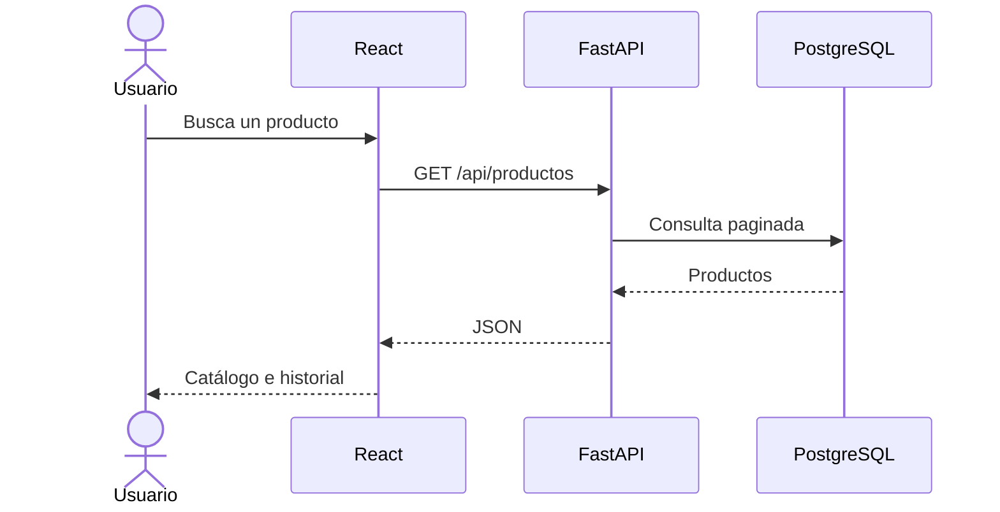
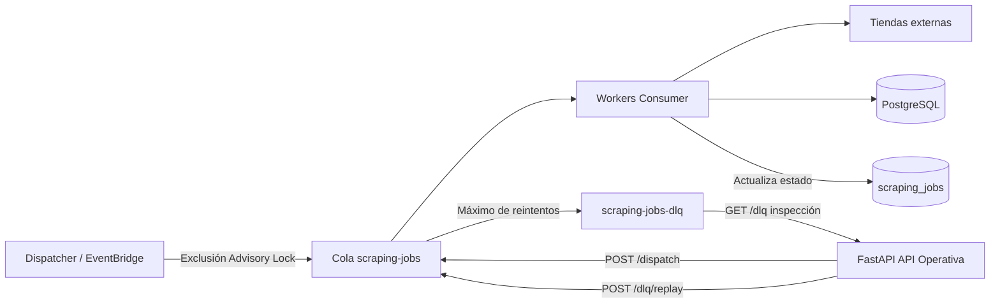

# Arquitectura

## Estilo

Arquitectura modular, contenerizada y orientada a eventos. El MVP no se denomina arquitectura completa de microservicios. La API y los workers son servicios desplegables de manera independiente.

## Contenedores lógicos

| Contenedor | Tecnología | Responsabilidad |
|---|---|---|
| Frontend | React, Vite, TypeScript | Interfaz, búsqueda y gráficos históricos. |
| API | FastAPI, Pydantic, SQLAlchemy | Contrato REST, validación y acceso a datos. |
| Worker | Python | Consumo de cola, scraping, normalización y persistencia. |
| Dispatcher | Python (`app.dispatcher`) | Programación determinista y despacho con lock distribuido. |
| Base de datos | PostgreSQL | Productos, tiendas, historial y estado de scraping. |
| Cola | Amazon SQS / PostgresQueue | Buffer y desacoplamiento de trabajos. |
| Programador | Amazon EventBridge / Cron local | Inicio periódico de extracciones. |

## Flujo de consulta



## Flujo de scraping y supervisión



## Límites de módulos

### Backend

```text
backend/app/
├── api/            # Routers HTTP
├── core/           # Configuración, seguridad y logging
├── db/             # Sesión y modelos de persistencia
├── schemas/        # Modelos Pydantic
├── repositories/   # Acceso a datos
├── services/       # Casos de uso
└── main.py
```

### Worker

```text
worker/app/
├── adapters/       # Un adaptador por tienda
├── consumers/      # Lectura de mensajes
├── services/       # Orquestación y normalización
├── repositories/   # Persistencia
└── main.py
```

### Frontend

```text
frontend/src/
├── api/
├── components/
├── features/
├── pages/
├── routes/
├── types/
└── main.tsx
```

## Decisiones

- La API no conserva estado de sesión en memoria.
- Los routers no contienen lógica de negocio.
- Los adaptadores de tiendas implementan una interfaz común.
- Los mensajes contienen identificadores, no objetos grandes.
- La base de datos es la fuente de verdad.
- Las integraciones AWS se abstraen para permitir pruebas locales.

## Supervisión y Control Operativo (Incremento 7)

El Incremento 7 dota a la plataforma de observabilidad completa, trazabilidad y control operativo sobre el ciclo de vida del scraping asíncrono:

- **Subincremento 7A (Commit `573107b`)**: Persistencia y ciclo de vida de `ScrapingJob` con máquina de estados (`queued`, `processing`, `retrying`, `completed`, `skipped`, `failed`, `dead_letter`), claves foráneas restrictivas y contadores acumulativos atómicos. Migración `005_create_scraping_jobs`.
- **Subincremento 7B (Commit `98fbd70`)**: Despacho determinista desacoplado (`app.dispatcher`) ejecutado como proceso independiente. Exclusión mutua distribuida mediante PostgreSQL Advisory Lock (`pg_try_advisory_lock`), normalización horaria `dispatch_slot`, constraint `ck_scraping_jobs_dispatch_slot_coherence` y endpoints de consulta (`/jobs`, `/jobs/{id}`, `/queue/metrics`, `/dispatch`). Migración `006_dispatch_slot_trigger_type`.
- **Subincremento 7C (Commit `0bce133`)**: Inspección sanitizada y replay transaccional de DLQ (`GET /dlq` y `POST /dlq/replay`). Bloqueo pesimista `ORDER BY id ASC FOR UPDATE`, transacción all-or-nothing, reinicio atómico de intentos (`attempts = 0`, `payload.attempt = 1`, `job.status = 'queued'`) y sanitización estricta de trazas y secretos. Migración `007_dlq_audit_and_replay`.
- **Subincremento 7D (Pospuesto por decisión de seguridad)**: Se postergó la creación del panel visual web `/operations` en el cliente público de Vite y la introducción de autenticación provisional basada en cookies HMAC para evitar duplicidad de esfuerzos, sesiones stateless sin revocación y exposición de credenciales.
- **Estado de pruebas**: Suite de 287 pruebas aprobadas (Backend: 104, Worker: 107, Frontend: 76).

## Seguridad de Acceso Operativo

Para proteger la integridad del sistema y separar estrictamente el rol público del administrativo:

1. **Operación administrativa provisional**: La supervisión, métricas, despacho manual y replay de DLQ se realizan exclusivamente en entorno de desarrollo local o redes controladas mediante Swagger UI (`/docs`) y herramientas REST autenticadas.
2. **Restricción de documentación en producción**: Los endpoints de Swagger (`/docs`), ReDoc (`/redoc`) y la especificación OpenAPI (`/openapi.json`) deben estar inhabilitados o protegidos por red en entornos productivos públicos.
3. **Manejo de `INTERNAL_API_KEY`**:
   - Funciona únicamente como credencial máquina-a-máquina (M2M) o clave de administración local.
   - Prohibida en el bundle de cliente (Vite) y en variables con prefijo `VITE_*`.
   - Prohibido su almacenamiento en `localStorage` o `sessionStorage`.
   - Prohibido su registro en logs de aplicación, URLs o mensajes de error.
   - Nunca se documenta con valores reales ni se versiona en el repositorio.
4. **Futura autenticación en la nube (AWS)**: La interfaz visual de administración se abordará en el despliegue cloud mediante soluciones robustas gestionadas (Amazon Cognito User Pools, autenticación OIDC integrada en Application Load Balancer o acceso restringido por VPN/red privada).
