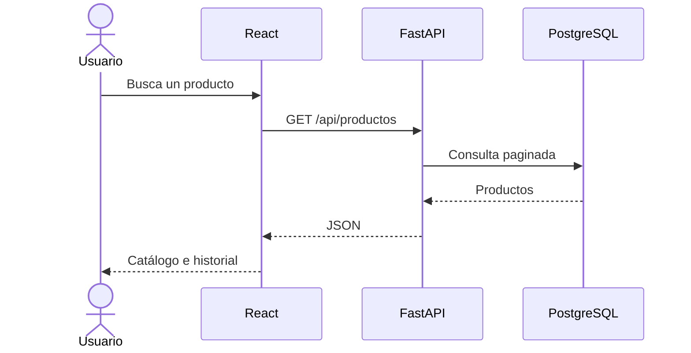
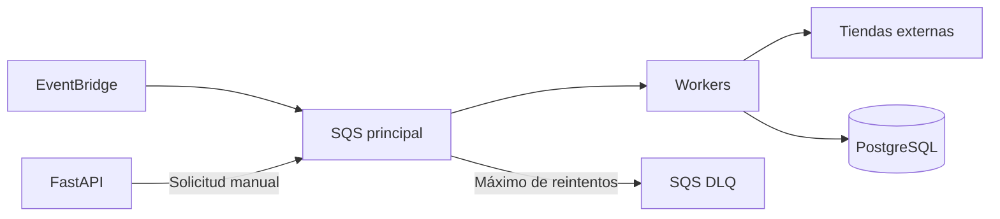

# Arquitectura

## Estilo

Arquitectura modular, contenerizada y orientada a eventos. El MVP no se denomina arquitectura completa de microservicios. La API y los workers son servicios desplegables de manera independiente.

## Contenedores lógicos

| Contenedor | Tecnología | Responsabilidad |
|---|---|---|
| Frontend | React, Vite, TypeScript | Interfaz, búsqueda y gráficos históricos. |
| API | FastAPI, Pydantic, SQLAlchemy | Contrato REST, validación y acceso a datos. |
| Worker | Python | Consumo de SQS, scraping, normalización y persistencia. |
| Base de datos | PostgreSQL | Productos, tiendas e historial de precios. |
| Cola | Amazon SQS | Buffer y desacoplamiento de trabajos. |
| Programador | Amazon EventBridge | Inicio periódico de extracciones. |

## Flujo de consulta



## Flujo de scraping



## Límites de módulos

### Backend

```text
backend/app/
├── api/            # Routers HTTP
├── core/           # Configuración, seguridad y logging
├── db/             # Sesión y modelos de persistencia
├── schemas/        # Modelos Pydantic
├── repositories/   # Acceso a datos
├── services/       # Casos de uso
└── main.py
```

### Worker

```text
worker/app/
├── adapters/       # Un adaptador por tienda
├── consumers/      # Lectura de mensajes
├── services/       # Orquestación y normalización
├── repositories/   # Persistencia
└── main.py
```

### Frontend

```text
frontend/src/
├── api/
├── components/
├── features/
├── pages/
├── routes/
├── types/
└── main.tsx
```

## Decisiones

- La API no conserva estado de sesión en memoria.
- Los routers no contienen lógica de negocio.
- Los adaptadores de tiendas implementan una interfaz común.
- Los mensajes contienen identificadores, no objetos grandes.
- La base de datos es la fuente de verdad.
- Las integraciones AWS se abstraen para permitir pruebas locales.

