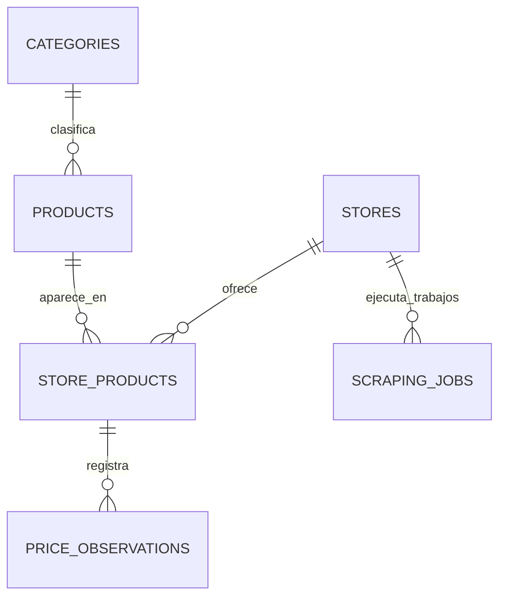

# Modelo de datos

## Entidades iniciales

### categories

| Campo | Tipo | Restricción |
|---|---|---|
| id | UUID | Clave primaria |
| name | VARCHAR(100) | Único, obligatorio |
| slug | VARCHAR(120) | Único, obligatorio |

### products

| Campo | Tipo | Restricción |
|---|---|---|
| id | UUID | Clave primaria |
| category_id | UUID | Clave foránea |
| name | VARCHAR(200) | Obligatorio |
| slug | VARCHAR(220) | Único, obligatorio |
| brand | VARCHAR(100) | Opcional |
| model | VARCHAR(120) | Opcional |
| image_url | TEXT | Opcional |
| is_active | BOOLEAN | Valor inicial `true` |
| created_at | TIMESTAMPTZ | Obligatorio |
| updated_at | TIMESTAMPTZ | Obligatorio |

### stores

| Campo | Tipo | Restricción |
|---|---|---|
| id | UUID | Clave primaria |
| name | VARCHAR(120) | Único, obligatorio |
| domain | VARCHAR(255) | Único, obligatorio |
| is_active | BOOLEAN | Valor inicial `true` |

### store_products

Relaciona un producto del catálogo con su página en una tienda.

| Campo | Tipo | Restricción |
|---|---|---|
| id | UUID | Clave primaria |
| product_id | UUID | Clave foránea |
| store_id | UUID | Clave foránea |
| external_sku | VARCHAR(150) | Opcional |
| product_url | TEXT | Obligatorio |
| is_active | BOOLEAN | Valor inicial `true` |

Restricción única: `(product_id, store_id, product_url)`.

### price_observations

| Campo | Tipo | Restricción |
|---|---|---|
| id | UUID | Clave primaria |
| store_product_id | UUID | Clave foránea |
| price | NUMERIC(12,2) | Mayor que cero |
| currency | CHAR(3) | Por ejemplo, `PEN` o `USD` |
| availability | VARCHAR(40) | Opcional |
| captured_at | TIMESTAMPTZ | Obligatorio |
| source_hash | VARCHAR(64) | Ayuda a evitar duplicados |

### scraping_jobs (Incremento 7)

Registra el ciclo de vida, trazabilidad y auditoría de cada trabajo de scraping por tienda.

| Campo | Tipo | Restricción |
|---|---|---|
| id | UUID | Clave primaria |
| store_id | UUID | Clave foránea a `stores(id)` ON DELETE RESTRICT |
| status | VARCHAR(20) | Obligatorio (`queued`, `processing`, `retrying`, `completed`, `skipped`, `failed`, `dead_letter`) |
| trigger_type | VARCHAR(20) | Obligatorio (`scheduled`, `manual`) |
| dispatch_slot | TIMESTAMPTZ | Nullable; obligatorio si `scheduled`, nulo si `manual` |
| batch_size | INTEGER | Obligatorio, mayor que cero |
| observations_created | INTEGER | Obligatorio, no negativo (acumulativo durante la vida del job) |
| attempts | INTEGER | Obligatorio, no negativo (0 al crear o tras replay) |
| error_reason | TEXT | Opcional, sanitizado (máx. 500 chars) |
| last_dlq_reason | TEXT | Opcional, preserva la causa del último fallo tras replay |
| sent_to_dlq_at | TIMESTAMPTZ | Opcional, fecha de entrada a DLQ |
| replay_count | INTEGER | Obligatorio, no negativo, acumulativo |
| replayed_at | TIMESTAMPTZ | Opcional, fecha del último replay |
| created_at | TIMESTAMPTZ | Obligatorio |
| started_at | TIMESTAMPTZ | Opcional, inicio de procesamiento |
| finished_at | TIMESTAMPTZ | Opcional, fin de procesamiento |

Restricción de unicidad: `(store_id, dispatch_slot)`.
Constraint de coherencia: `(trigger_type = 'scheduled' AND dispatch_slot IS NOT NULL) OR (trigger_type = 'manual' AND dispatch_slot IS NULL)`.

### local_queue_messages (Módulo de Colas)

Mecanismo local de colas en PostgreSQL con semántica compatible con Amazon SQS.

| Campo | Tipo | Restricción |
|---|---|---|
| id | UUID | Clave primaria (conservada inequívocamente entre cola y DLQ) |
| queue_name | VARCHAR(80) | Obligatorio (`scraping-jobs`, `scraping-jobs-dlq`) |
| payload | JSONB | Obligatorio (metadatos del trabajo y productos) |
| receipt_handle | UUID | Opcional, identificador efímero de lectura bloqueada |
| status | VARCHAR(20) | Obligatorio (`pending`, `processing`, `completed`, `dlq`) |
| attempts | INTEGER | Obligatorio, no negativo (reinicio a 0 al replay) |
| visible_at | TIMESTAMPTZ | Obligatorio, controla recuperación de visibilidad |
| created_at | TIMESTAMPTZ | Obligatorio |
| processed_at | TIMESTAMPTZ | Opcional, fecha de finalización o envío a DLQ |
| sent_to_dlq_at | TIMESTAMPTZ | Opcional, fecha de ingreso a DLQ (Migración 007) |
| replay_count | INTEGER | Obligatorio, no negativo, acumulativo (Migración 007) |
| replayed_at | TIMESTAMPTZ | Opcional, fecha de última reproducción (Migración 007) |
| error_reason | TEXT | Opcional, sanitizado |

Índice de inspección: `(queue_name, status, sent_to_dlq_at)`.

## Relaciones

## Convenciones

- Nombres de tablas y columnas en `snake_case`.
- Fechas almacenadas en UTC con zona horaria.
- Migraciones administradas con Alembic.
- Borrado lógico mediante `is_active` para productos y tiendas.
- UUID para identificadores distribuidos, no como control de seguridad.

