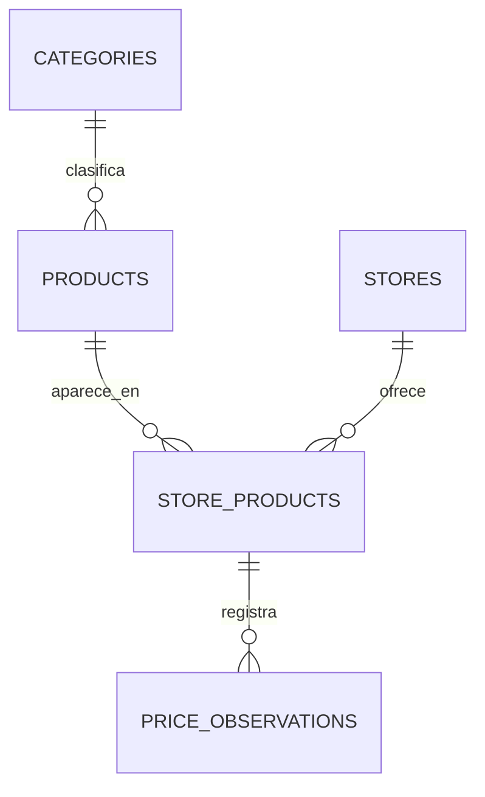

# Modelo de datos

## Entidades iniciales

### categories

| Campo | Tipo | Restricción |
|---|---|---|
| id | UUID | Clave primaria |
| name | VARCHAR(100) | Único, obligatorio |
| slug | VARCHAR(120) | Único, obligatorio |

### products

| Campo | Tipo | Restricción |
|---|---|---|
| id | UUID | Clave primaria |
| category_id | UUID | Clave foránea |
| name | VARCHAR(200) | Obligatorio |
| slug | VARCHAR(220) | Único, obligatorio |
| brand | VARCHAR(100) | Opcional |
| model | VARCHAR(120) | Opcional |
| image_url | TEXT | Opcional |
| is_active | BOOLEAN | Valor inicial `true` |
| created_at | TIMESTAMPTZ | Obligatorio |
| updated_at | TIMESTAMPTZ | Obligatorio |

### stores

| Campo | Tipo | Restricción |
|---|---|---|
| id | UUID | Clave primaria |
| name | VARCHAR(120) | Único, obligatorio |
| domain | VARCHAR(255) | Único, obligatorio |
| is_active | BOOLEAN | Valor inicial `true` |

### store_products

Relaciona un producto del catálogo con su página en una tienda.

| Campo | Tipo | Restricción |
|---|---|---|
| id | UUID | Clave primaria |
| product_id | UUID | Clave foránea |
| store_id | UUID | Clave foránea |
| external_sku | VARCHAR(150) | Opcional |
| product_url | TEXT | Obligatorio |
| is_active | BOOLEAN | Valor inicial `true` |

Restricción única: `(product_id, store_id, product_url)`.

### price_observations

| Campo | Tipo | Restricción |
|---|---|---|
| id | UUID | Clave primaria |
| store_product_id | UUID | Clave foránea |
| price | NUMERIC(12,2) | Mayor que cero |
| currency | CHAR(3) | Por ejemplo, `PEN` o `USD` |
| availability | VARCHAR(40) | Opcional |
| captured_at | TIMESTAMPTZ | Obligatorio |
| source_hash | VARCHAR(64) | Ayuda a evitar duplicados |

Índice principal: `(store_product_id, captured_at DESC)`.

## Relaciones

## Convenciones

- Nombres de tablas y columnas en `snake_case`.
- Fechas almacenadas en UTC con zona horaria.
- Migraciones administradas con Alembic.
- Borrado lógico mediante `is_active` para productos y tiendas.
- UUID para identificadores distribuidos, no como control de seguridad.

